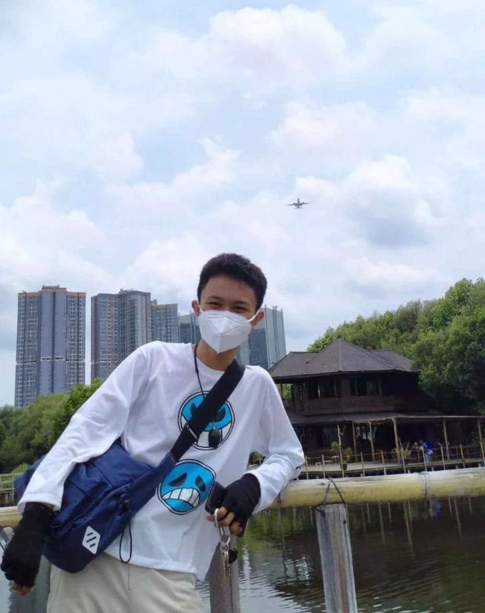

<head>
    <meta charset="UTF-8">
    <meta name="viewport" content="width=device-width, initial-scale=1.0">
    <title>Biodata Rahmat Ramadan</title>
    <link href="https://fonts.googleapis.com/css2?family=Roboto:wght@400;700&display=swap" rel="stylesheet">
    
</head>
<body>
    

        <h1>Biodata Rahmat Ramadan</h1>
        
        

            <!-- Ganti 'profile.jpg' dengan URL atau path file foto profil Anda -->
            
            

                Halo! Saya Rahmat Ramadan, lahir Di Jakarta pada Tanggal 27 November 2002. Saya tinggal di Jl.Walang, Koja, Jakarta Utara. Saya sangat menyukai desain, Diy dan menggambar manual, yang sering saya lakukan di waktu luang saya. Selain itu, saya juga suka berkreasi dengan kode program, khususnya dalam pengembangan web dan aplikasi Management Data. Berikut Rincian Profil Tentang Saya
            

        

        

            <h2>Informasi Pribadi</h2>
            
<strong>Nama:</strong> Rahmat Ramadan

            
<strong>Alamat:</strong> Jl.Walang, Koja, Jakarta Utara

            
<strong>Tempat, Tanggal Lahir:</strong> Jakarta, 27 November 2002

        

        

            <h2>Pendidikan</h2>
            
SMK Jurusan Akuntansi

            
S1 Teknik Informatika

        

        

            <h2>Pengalaman Kerja</h2>
            <ul>
                <li>Freelance PT.Indo Arsip</li>
                <li>Membuat Project Pembuatan Aplikasi Manajemen Data</li>
                <li>Membuat Project Website Catalog Penjualan</li>
                <li>Membuat Website Untuk Manajemen Data</li>
            </ul>
        

        

            <h2>Keahlian</h2>
            <ul>
                <li>HTML/CSS - Penguasaan dalam membuat dan menata halaman web</li>
                <li>JavaScript - Kemampuan dalam membuat fungsi interaktif pada situs web</li>
                <li>Java Netbeans - Membuat Aplikasi Management Data</li>
                <li>Database Management - Pengetahuan tentang MySQL</li>
                <li>Microsoft Office - Mampu Mengoperasikan Ms.Word, Ms.Excel, Ms.PowerPoint</li>
            </ul>
        

        

            <h2>Hobi</h2>
            <ul>
                <li>Desain</li>
                <li>Menggambar Manual</li>
            </ul>
        

        

            <h2>Kontak</h2>
            
<strong>No HP:</strong> 089526260859

            
<strong>Email:</strong> rahmatramadan077@gmail.com

        

        <!-- Tombol untuk halaman berikutnya -->
        

            <a href="sertifikat.html">Lihat Ijazah dan Sertifikat</a>
        

    

</body>
</html>
